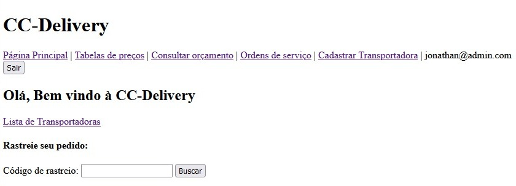
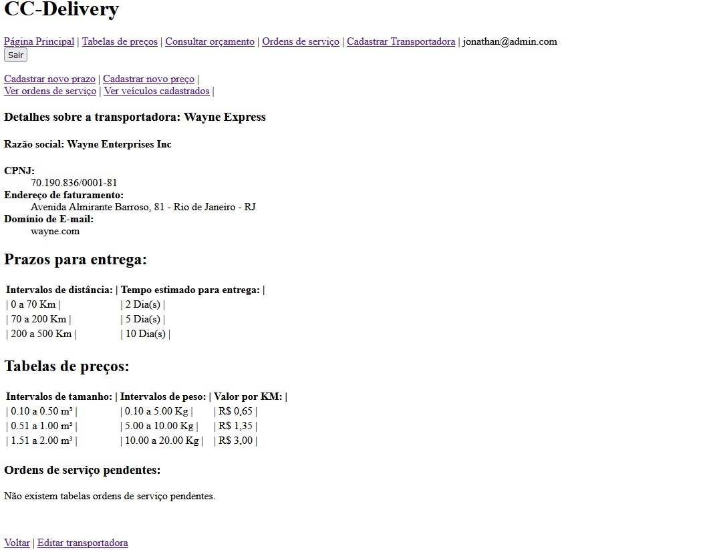
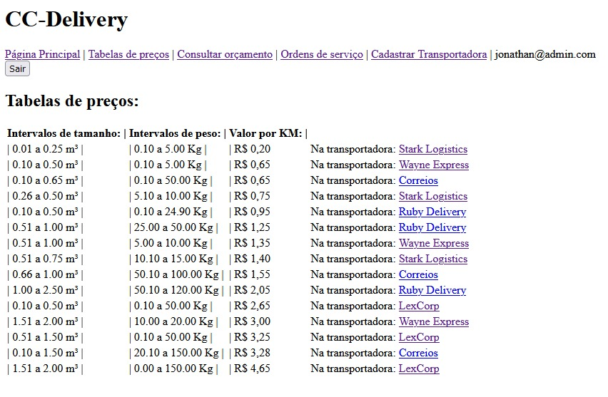
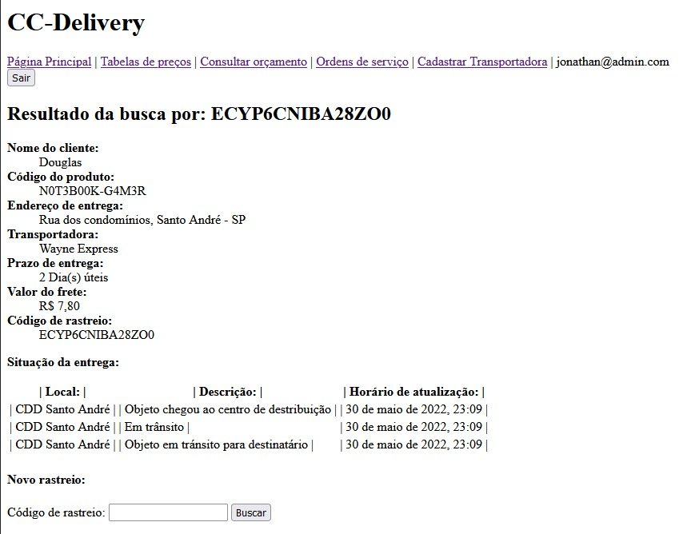

<h1 align="center"> Campus Delivery </h1>

 

### Tabela de Conteúdos 🗺️:
  🔹	[Descrição do projeto](#descrição-do-projeto)
  🔹	[Funcionalidades](#funcionalidades)
  🔹	[Gems utilizadas](#gems-utilizadas)
  🔹	[Como instalar a aplicação](#como-instalar-a-aplicação)
  🔹	[Configurando o banco de dados](#configurando-o-banco-de-dados)
   🔹	[Layout da aplicação](#layout-da-aplicação)
  🔹	[Ideias para implementações futuras](#ideias-para-implementações-futuras)

#### 
 Descrição do projeto 

O projeto consiste da criação de uma aplicação web responsável por gerenciar meios de transporte disponíveis para e-commerces.

#### 
 Funcionalidades 

- [X] Administradores da plataforma podem cadastrar transportadoras, bem como classificá-las como ativas ou inativas para buscas ou orçamentos futuros
- [X] Administradores podem consultar valores de frete de suas transportadoras.
- [X] Transporadoras podem cadastrar usuários vinculadas e ela
- [X] Usuários só podem visualizar sua transportadora na plataforma
- [x] Usuários podem cadastrar veículos, prazos e valores de frete
- [X] Usuários podem aceitar ou recusar ordens de serviço
- [X] Usuários podem atualizar as ordens de serviço
- [x] Visitante pode rastrear seu pedido

##### Linguagem e Gems utilizadas :gem::

- [Ruby 3.0](https://ruby-doc.org) - Linguagem utilizada
- [Rails 7.0](https://guides.rubyonrails.org) - Framerwork utilizado para desenvolver o projeto
- [Rspec](https://github.com/rspec/rspec-rails) - Utilizado para os testes da aplicação
- [Capybara](https://github.com/teamcapybara/capybara#using-capybara-with-rspec) -Auxilia o rspec durante os testes
- [Devise](https://github.com/heartcombo/devise) -	Utilziada para gerenciamento dos usuários
- [Pry-byebug](https://github.com/deivid-rodriguez/pry-byebug) - Utilizada para debugar o código

#### Como instalar a aplicação:

Clone o repositório em seu computador: 

    $ git clone  https://github.com/jonathandeoliveira/campus-delivery.git 

Instale as dependencias do projeto:

    $ bundle install

Inicie o servidor:

    $ rails server

Rodando os testes:

    rspec

#### Configurando banco de dados:
Execute o comando seed no seu console para popular o banco de dados:

    rails db:seed

#### Layout da aplicação:

### Ideias para implementações futuras 📖:
* Utilização da Gem FriendlyId para urls personalizadas
* Cálculo de frete via CEP
* Melhorar o front-end da aplicação

